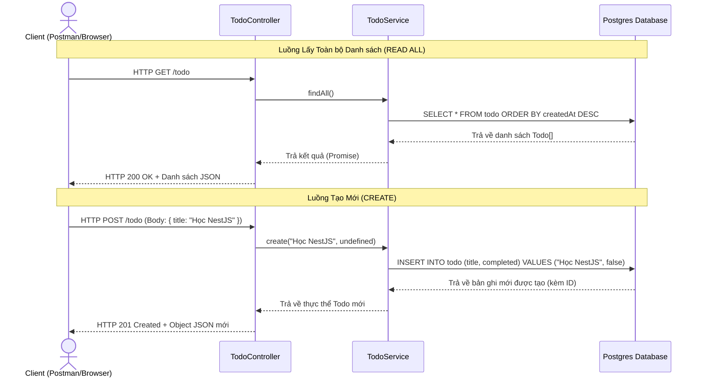

# Giải thích Kiến trúc CRUD & Cú pháp NestJS (Todo Feature)

Tài liệu này giải thích chi tiết về cấu trúc phân tầng (Controller & Service), luồng xử lý dữ liệu (Workflow) và ý nghĩa của các cú pháp Decorator (`@`) được sử dụng trong dự án NestJS Todo.

---

## 1. Cấu trúc Phân tầng (Architecture)

NestJS sử dụng mô hình thiết kế chia nhỏ trách nhiệm (Separation of Concerns). Trong tính năng `todo`, code được chia làm 3 phần chính:

```
[Client (Postman/Browser)] 
         │
         ▼ (HTTP Requests: GET, POST, PATCH, DELETE)
┌────────────────────────────────────────────────────────┐
│ 1. Controller Layer (todo.controller.ts)               │
│ - Định tuyến các HTTP Request                          │
│ - Ép kiểu, kiểm tra dữ liệu đầu vào (Param, Body, Pipe)│
└────────────────────────┬───────────────────────────────┘
                         │
                         ▼ (Gọi hàm & truyền tham số)
┌────────────────────────────────────────────────────────┐
│ 2. Service Layer (todo.service.ts)                     │
│ - Chứa logic nghiệp vụ thực tế                         │
│ - Gọi Repository để truy vấn cơ sở dữ liệu             │
│ - Xử lý lỗi nghiệp vụ (ví dụ: NotFoundException)       │
└────────────────────────┬───────────────────────────────┘
                         │
                         ▼ (SQL Queries)
┌────────────────────────────────────────────────────────┐
│ 3. Database Layer (PostgreSQL - Todo Entity)           │
│ - Bảng dữ liệu lưu trữ vật lý                          │
└────────────────────────────────────────────────────────┘
```

---

## 2. Luồng Hoạt động Chi tiết (Workflow)

Dưới đây là sơ đồ tuần tự thể hiện đường đi của dữ liệu khi một Client gửi request `GET /todo` hoặc `POST /todo`:



---

## 3. Ý nghĩa của Decorators (`@`)

Các cú pháp bắt đầu bằng `@` được gọi là **Decorators**. Đây là cách NestJS khai báo cấu hình động, định tuyến và tiêm phụ thuộc (Dependency Injection) mà không cần viết nhiều code thủ công.

### A. Các Decorator quản lý Class & Dependency Injection

| Decorator | Vị trí áp dụng | Công dụng | Nếu bỏ đi sẽ ra sao? |
| :--- | :--- | :--- | :--- |
| `@Controller('todo')` | Đầu Class `TodoController` | Định nghĩa class này là bộ xử lý Router cho các request bắt đầu bằng `/todo`. | NestJS sẽ bỏ qua class này, các API của bạn sẽ trả về `404 Not Found`. |
| `@Injectable()` | Đầu Class `TodoService` | Đánh dấu class là một Provider, cho phép NestJS tự động khởi tạo và tiêm (inject) vào constructor của Controller. | Hệ thống Dependency Injection của NestJS sẽ báo lỗi không tìm thấy Provider phù hợp khi khởi chạy ứng dụng. |
| `@InjectRepository(Todo)` | Constructor của `TodoService` | Tiêm class thao tác Database (Repository) dành riêng cho thực thể `Todo`. | Biến `todoRepository` sẽ bị `undefined` và bạn không thể gọi các hàm truy vấn DB như `.save()`, `.find()`. |

### B. Các Decorator định tuyến HTTP (Request Mapping)

Đặt ở trước các method trong Controller:
*   `@Post()`: Ánh xạ yêu cầu `POST /todo` (Dùng cho **C**reate).
*   `@Get()`: Ánh xạ yêu cầu `GET /todo` (Dùng cho **R**ead All).
*   `@Patch(':id')`: Ánh xạ yêu cầu `PATCH /todo/:id` (Dùng cho **U**pdate).
*   `@Delete(':id')`: Ánh xạ yêu cầu `DELETE /todo/:id` (Dùng cho **D**elete).

> **Nếu bỏ đi:** Các phương thức này trở thành hàm JavaScript bình thường và không thể gọi được từ môi trường internet/mạng.

### C. Các Decorator lấy tham số truyền vào (Parameter Decorators)

Đặt ở trước các đối số của hàm trong Controller:

*   `@Body('title')`: Trích xuất trường `title` trong phần JSON Body gửi lên.
    *   *Nếu bỏ:* Tham số nhận vào sẽ là `undefined`.
*   `@Param('id', ParseIntPipe)`: Lấy tham số `:id` từ thanh địa chỉ. `ParseIntPipe` sẽ tự động chuyển đổi chuỗi chữ `"12"` thành số `12` hoặc chặn lại và báo lỗi `400 Bad Request` nếu client truyền vào `"abc"`.
    *   *Nếu bỏ:* Hàm của bạn không nhận được ID của bản ghi cần tác động.

---

## 4. Giải thích chi tiết về Param, Body, và Pipe

Đây là ba thành phần cốt lõi được sử dụng để nhận dạng, đóng gói và xử lý dữ liệu truyền từ client lên server thông qua các request HTTP.

### A. `@Param` (Route Parameter)
*   **Khái niệm:** Dùng để lấy các biến động nằm trên thanh địa chỉ URL. Những biến này được định nghĩa bằng dấu hai chấm `:` trong route (ví dụ: `:id`).
*   **Ví dụ:**
    ```typescript
    @Delete(':id')
    remove(@Param('id') id: string) { ... }
    ```
*   **Cách hoạt động:** 
    *   Nếu client gửi yêu cầu `DELETE /todo/45`, khi này biến `:id` trên URL là `"45"`.
    *   `@Param('id')` sẽ trích xuất chữ `"45"` đó ra và gán vào biến `id` trong hàm để bạn sử dụng.

### B. `@Body` (Request Body)
*   **Khái niệm:** Dùng để lấy dữ liệu được gửi ẩn dưới phần **Body** của HTTP Request (thường là dữ liệu JSON khi submit form, tạo mới hoặc cập nhật).
*   **Ví dụ:**
    ```typescript
    @Post()
    create(@Body('title') title: string, @Body('completed') completed?: boolean) { ... }
    ```
*   **Cách hoạt động:**
    *   Nếu client gửi một request `POST /todo` với JSON Body:
        ```json
        {
          "title": "Học NestJS",
          "completed": false
        }
        ```
    *   `@Body('title')` sẽ trích xuất riêng thuộc tính `"Học NestJS"`.
    *   Bạn cũng có thể viết `@Body() body: any` để lấy nguyên toàn bộ đối tượng JSON đó.

### C. `Pipe` (Đường ống xử lý dữ liệu)
*   **Khái niệm:** `Pipe` là một bộ lọc trung gian nằm giữa **HTTP Request** và **Hàm xử lý trong Controller**.
*   **Vai trò chính:**
    1.  **Chuyển đổi dữ liệu (Transformation):** Chuyển dữ liệu từ kiểu này sang kiểu khác (ví dụ: chuyển string thành number).
    2.  **Xác thực dữ liệu (Validation):** Kiểm tra dữ liệu gửi lên có hợp lệ không (ví dụ: có rỗng không, có đúng định dạng email không...). Nếu không hợp lệ, Pipe sẽ lập tức chặn request lại và trả về lỗi `400 Bad Request` trước khi code chạy vào Controller.
*   **Ví dụ sử dụng `ParseIntPipe`:**
    ```typescript
    @Patch(':id')
    update(@Param('id', ParseIntPipe) id: number) { ... }
    ```
    *   **Thực tế:** Các tham số lấy từ URL (`@Param`) luôn mặc định là kiểu chuỗi (String).
    *   **Nếu client truyền `/todo/12`:** `ParseIntPipe` nhận chuỗi `"12"`, tự động ép kiểu thành số `12` (Number) rồi truyền cho biến `id`.
    *   **Nếu client truyền `/todo/abc`:** `ParseIntPipe` nhận thấy `"abc"` không thể chuyển thành số, nó sẽ ngay lập tức trả về lỗi cho client:
        ```json
        {
          "statusCode": 400,
          "message": "Validation failed (numeric string is expected)",
          "error": "Bad Request"
        }
        ```
        Hàm `update` trong Controller của bạn sẽ không bao giờ bị thực thi với dữ liệu rác này, giúp bảo vệ server.

---

## 5. Hướng dẫn Test API bằng Postman

Trước khi test, hãy chắc chắn rằng Server của bạn đã khởi chạy bằng lệnh:
```bash
npm run start:dev
```
*Mặc định NestJS chạy ở cổng **3000** (URL gốc: `http://localhost:3000`).*

### 1. Test API: Thêm mới Todo (CREATE)
*   **Method (Phương thức):** `POST`
*   **URL:** `http://localhost:3000/todo`
*   **Thiết lập trên Postman:**
    1. Chọn Method `POST` ở thanh bên trái của URL.
    2. Nhập URL `http://localhost:3000/todo`.
    3. Chọn tab **Body** bên dưới URL -> chọn tiếp **raw** -> chọn kiểu dữ liệu là **JSON** (ở cuối dòng).
    4. Nhập nội dung JSON sau vào ô soạn thảo:
       ```json
       {
         "title": "Học NestJS cơ bản",
         "completed": false
       }
       ```
    5. Nhấn **Send**.
*   **Kết quả trả về mong đợi (201 Created):**
    ```json
    {
      "id": 1,
      "title": "Học NestJS cơ bản",
      "completed": false,
      "createdAt": "2026-06-15T16:04:02.000Z"
    }
    ```

---

### 2. Test API: Lấy toàn bộ danh sách Todo (READ ALL)
*   **Method:** `GET`
*   **URL:** `http://localhost:3000/todo`
*   **Thiết lập trên Postman:**
    1. Chọn Method `GET`.
    2. Nhập URL `http://localhost:3000/todo`.
    3. Nhấn **Send**.
*   **Kết quả trả về mong đợi (200 OK):**
    ```json
    [
      {
        "id": 1,
        "title": "Học NestJS cơ bản",
        "completed": false,
        "createdAt": "2026-06-15T16:04:02.000Z"
      }
    ]
    ```

---

### 3. Test API: Cập nhật Todo theo ID (UPDATE)
*   **Method:** `PATCH`
*   **URL:** `http://localhost:3000/todo/1` (Số `1` ở đây là `id` của Todo bạn muốn sửa)
*   **Thiết lập trên Postman:**
    1. Chọn Method `PATCH`.
    2. Nhập URL `http://localhost:3000/todo/1`.
    3. Chọn tab **Body** -> **raw** -> chọn **JSON**.
    4. Nhập nội dung cập nhật (ví dụ đổi trạng thái thành hoàn thành):
       ```json
       {
         "completed": true
       }
       ```
    5. Nhấn **Send**.
*   **Kết quả trả về mong đợi (200 OK):**
    ```json
    {
      "id": 1,
      "title": "Học NestJS cơ bản",
      "completed": true,
      "createdAt": "2026-06-15T16:04:02.000Z"
    }
    ```

---

### 4. Test API: Xóa Todo theo ID (DELETE)
*   **Method:** `DELETE`
*   **URL:** `http://localhost:3000/todo/1`
*   **Thiết lập trên Postman:**
    1. Chọn Method `DELETE`.
    2. Nhập URL `http://localhost:3000/todo/1`.
    3. Nhấn **Send**.
*   **Kết quả trả về mong đợi (200 OK):**
    Phản hồi sẽ trống (hoặc không có body), status code là `200 OK`. Khi bạn gửi tiếp request `GET /todo`, phần tử đó sẽ không còn xuất hiện nữa.


